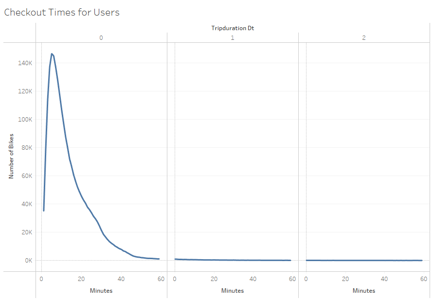
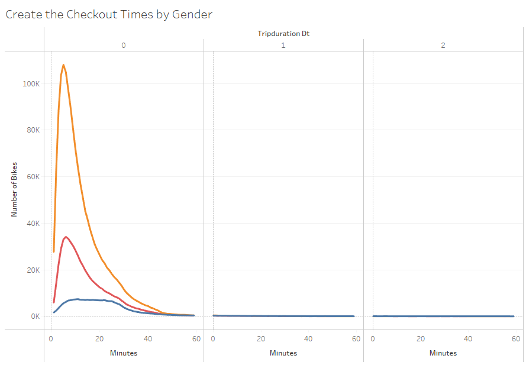
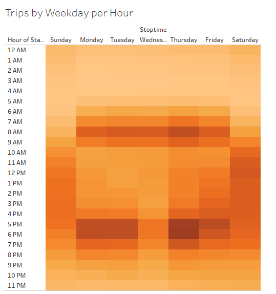
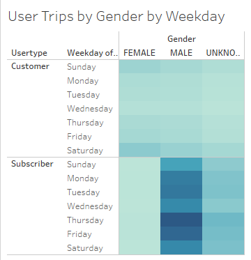
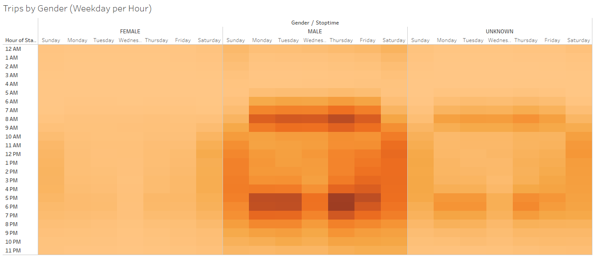
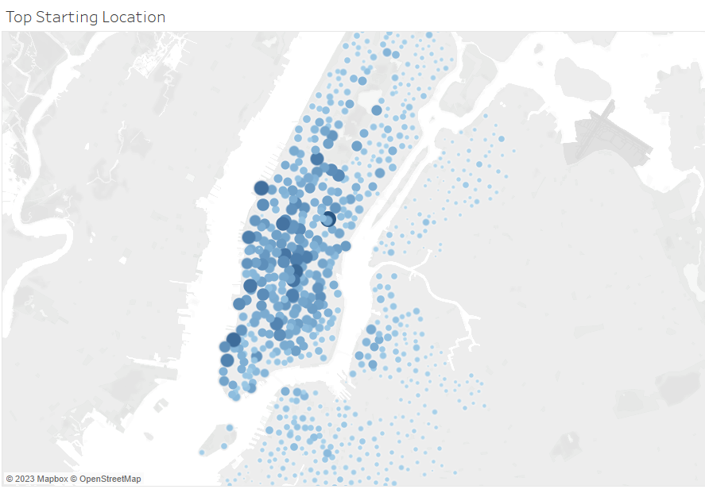
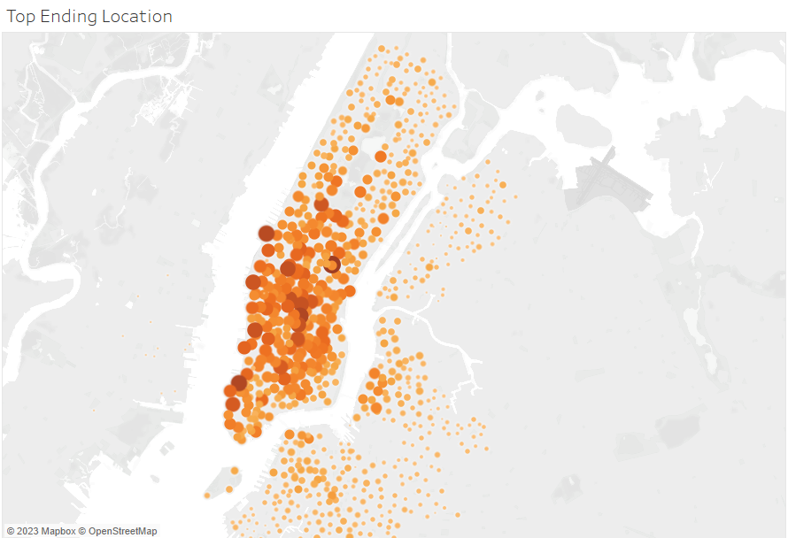

# Bikesharing Analysis

## [Link to dashboard](https://public.tableau.com/app/profile/alina.n.robertson/viz/BikesharingAnalysis_16745733932000/Dashboard4 "Link to dashboard")

## Overview
 Using public data from New York's Citibike, I utilized Jupyter Notebook and Pandas to change the "tripduration" column from an integer to a datetime datatype. Then, using the converted datatype, I created a set of visualizations through Tableau. This can allow for research for cities that would like to create this service for use.
 
 ## Results

### Checkout Times 

The first line chart shown allows us to see that overall users of Citibike had put the bike for use between five to twenty minutes while the second line chart shows the same thing except narrowing it down by gender. With these visuals we are able to see that the use of a Citibike is used for short term momentary use rather than long term use.

### Trips by Weekday

The heat maps above show usage by the hour. In the "Trips by Weekday per Hour" we can see the darkest colors align around the time one commutes to and from work (between 7 am- 9am and between 5 pm- 7pm). We have also navigated through the information to show which gender uses Citibikes more frequently! As shown in the "Trips by Gender" heat map, you can see that the male population in New York tend to ride Citibikes more than females do.

### Starting and Ending Locations

When it comes to location, we can see that the starting and ending locations are not too far in distance from the start station, to its' ending station. From this information, one can decide how many Citibike shops to create and have running for bike maintenance. 

## Summary
For the purpose of this analysis, researching this information can prove to be useful for a company that would like to open up a similar service within their area. I believe for a further in depth study, one should take into account both cost of maintenance and the profit it will bring.
